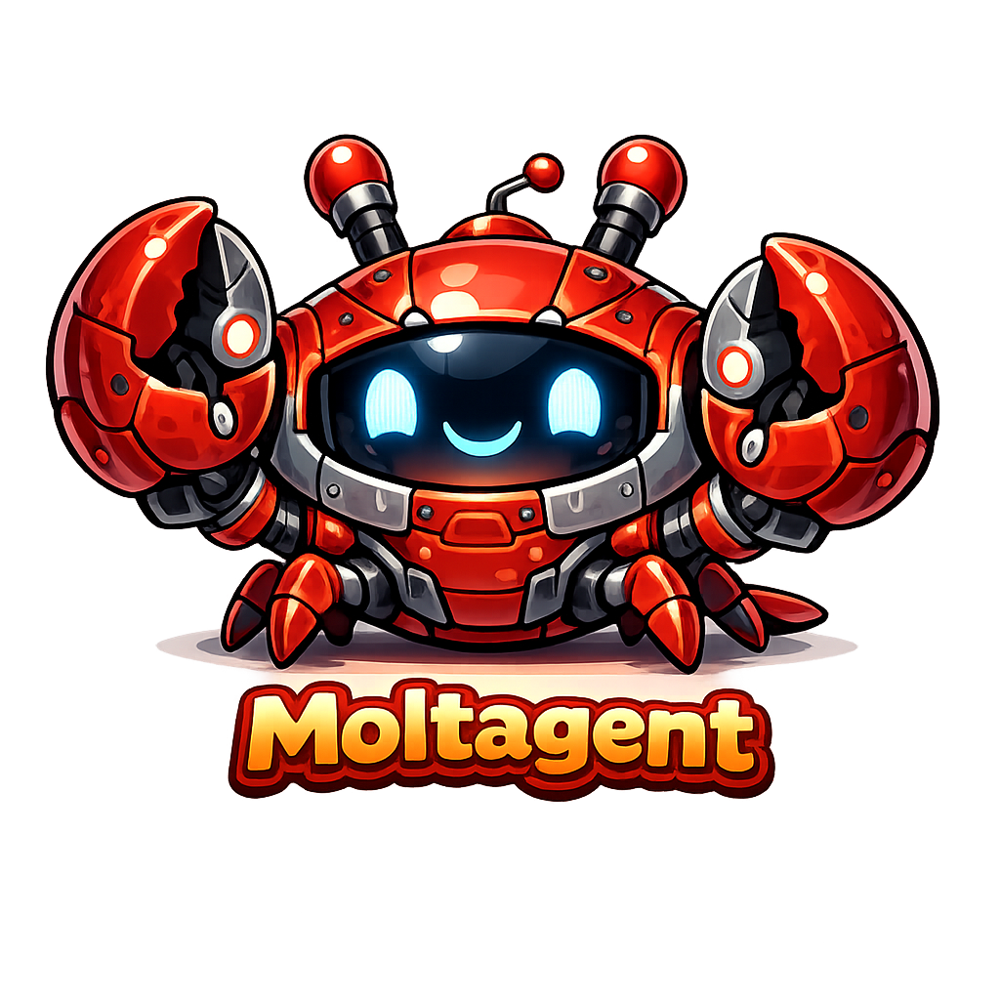

<p align="center">
  <picture>
    <source media="(prefers-color-scheme: dark)" srcset="assets/logo-dark.png">
    <source media="(prefers-color-scheme: light)" srcset="assets/logo-light.png">
    
  </picture>
</p>

# Moltagent

**Sovereign AI agent platform built on Nextcloud.**

Your AI employee. Your infrastructure. Your rules.

<!-- 
  Badge row: CC will generate these from live repo data
  Target badges: CI status | AGPL-3.0 license | latest release | GitHub stars | Discord/community
-->

<!--
  Hero image: architecture diagram or screenshot goes here
  CC will render from the simplified architecture diagram below
-->

---

> ⚠️ **Status: Beta. Built for our own use, shared for yours.**
> 
> Moltagent runs in production for its creator. I use it daily for content workflows, knowledge management, and editorial operations. But the architecture is still evolving, and some features are partially implemented.
> 
> The `main` branch is what we run in production. The `next` branch is where active development happens. Expect breaking changes on `next`.
> 
> It lacks polish. It's a working system I am sharing because I believe sovereign AI infrastructure should be open source.
> 
> **How this is built:** The entire codebase is developed in collaboration with Claude (Anthropic). A human (me) defines the architecture, writes briefings, makes design decisions, reviews every commit, and tests in production. Claude implements. Every feature starts as a written specification, not a prompt. Call it vibe-coding if you want, for me it's AI-assisted development. I could never produce the level of code Claude produces, but I can create better architecture and creative solutions.

---

## Why This Exists

I am a serial entrepreneur and help people to run businesses. Editorial offices, content production, client work. We needed an AI assistant that could handle email, calendar, research, and content workflows across small teams.

Everything we tried had the same problem: our data leaves our infrastructure, lives on someone else's servers, under someone else's jurisdiction, with someone else's TOS. Even if you don't care about GDPR, you're running the risk of losing your work, your setup and your business context if the political or commercial framework shifts. And that's what's happening right now.

Credentials are stored who-knows-where. There is no way to audit what the AI accessed and did. No kill switch that works in under a minute. Revoking can become a nightmare.

We looked for something that would run on our own infrastructure, potentially on a box in a basement of an off-grid farm. It should integrate with the tools we already use, and give us real control. And somehow that didn't exist.

So I built it.

Moltagent is an AI employee that lives in Nextcloud. It has its own account, its own files, its own calendar, its own task board and email. You share what you want to share with it, exactly like onboarding a human colleague. And you can revoke all access with one click, exactly like offboarding one.

I'm sharing it as open source because every business should be able to use AI in a safe way and sovereign business infrastructure shouldn't be proprietary.

Take it, explore it, build on it. Improve it.

Let's go!

---

## What It Does

Moltagent is one digital employee for your team, not a personal assistant per user. It builds institutional knowledge across all interactions.

**Works in Nextcloud**:
Files, calendar, contacts, email, tasks, wiki, kanban boards. No external SaaS dependencies for your data.

**Workflow engine**:
Write rules as plain sentences on kanban cards. The agent reads them and executes. No visual programming, no node graphs, no code. Human checkpoints (GATE labels) wherever you need editorial judgment.

**Living memory**:
Knowledge wiki with confidence tracking and freshness management. The agent learns from documents, conversations, and workflows. Knowledge that isn't accessed decays naturally. Knowledge that's used strengthens.

**Trust boundaries**:
Every operation classified as trusted or untrusted. Sensitive work routes to local LLM automatically. Credentials fetched at the moment of use, immediately discarded. Never stored on disk.

**Sovereign search**:
SearXNG + Stract + Mojeek. No Google, no tracking, no filter bubbles.

**Voice and email**:
Speech-to-text, full IMAP/SMTP integration. Human-in-the-loop for sending.

**Cost metering**:
Per-model budget enforcement. Daily limits, automatic fallback to local when budget exhausted. You always know what you're spending.

**Multilingual**:
German, English, Portuguese on day one. The LLM is the language layer, not the code.

**Instant revocation**:
Disable the agent's Nextcloud account. All access stops. Under 60 seconds to full lockdown. Or revoke single API credentials when needed. Simple.

---

## How It Works

```
┌───────────────────────────────────────────────────────────┐
│                    YOUR INFRASTRUCTURE                    │
│                                                           │
│  ┌───────────────┐  ┌───────────────┐  ┌───────────────┐  │
│  │  Nextcloud    │  │  Moltagent    │  │  Ollama       │  │
│  │  StorageShare │  │  Bot VM       │  │  (Local LLM)  │  │
│  │               │  │               │  │               │  │
│  │  • Identity   │  │               │  │               │  │
│  │  • Files      │  │  • Agent      │  │  • Air-       │  │
│  │  • Passwords  │  │    runtime    │  │    gapped     │  │
│  │  • Calendar   │  │  • No secrets │  │  • Handles    │  │
│  │  • Wiki       │  │    stored     │  │    sensitive  │  │
│  │  • Audit logs │  │               │  │    ops        │  │
│  └───────┬───────┘  └───────┬───────┘  └────────┬──────┘  │
│          │    HTTPS         │   Ollama API      │         │
│          │◄─────────────────┤◄──────────────────┤         │
│          │                  │                   │         │
│          │                  ├──► Cloud LLM APIs │         │
│          │                  │   (allowlisted)   │         │
└──────────┴──────────────────┴───────────────────┴─────────┘
```

Three components, network-isolated. Compromise of one does not compromise the others. The Ollama VM has no internet access and credential-sensitive operations never leave your infrastructure.

→ [Full architecture documentation](docs/architecture.md)

---

## LLM Providers

Moltagent is provider-agnostic with 13 supported adapters. Choose your tradeoff:

| Preset          | Cockpit Name | What happens                                                | Cost       |
| --------------- | ------------ | ----------------------------------------------------------- | ---------- |
| **all-local**   | Local Only   | Everything runs on your Ollama. Zero cloud cost.            | €0         |
| **smart-mix**   | Balanced     | Cloud primary, local fallback. Cost-optimized per job type. | ~€3-20/mo  |
| **cloud-first** | Premium      | Cloud only. Maximum quality.                                | ~€10-50/mo |

Supported: Anthropic, OpenAI, Google, DeepSeek, Mistral, Groq, Perplexity, OpenRouter, xAI, Together, Fireworks, Ollama, or add your own.

Two hard rules regardless of preset: credential operations always stay local, and all presets fall back to local when cloud is unavailable. Your agent never goes dark.

→ [Full provider configuration and job routing](docs/providers.md)

---

## Current State

**Live development dashboard at** [public.moltagent.cloud](https://public.moltagent.cloud) - mission control with feature verification status, architecture graph, commit history, and knowledge lifecycle visualization. Updated live from the production VM.

We use Moltagent daily for our own operations. Here's a picture of where things stand:

**Working and in daily use:**

- Nextcloud integration (files, calendar, contacts, email, wiki, Kanban deck)
- Workflow engine with GATE/PAUSED/SCHEDULED/ERROR label state machine
- Content pipeline (idea evaluation → drafting → revision → editorial review → publishing)
- Knowledge wiki with document ingestion and entity extraction
- Sovereign search (SearXNG + Stract + Mojeek)
- Voice pipeline (Speaches STT)
- Cost metering and budget enforcement
- LLM routing with 13 provider adapters
- 217 tests, all passing

**Working but still being refined:**

- Workflow scheduling and timed card activation
- Multi-board spawning and cross-board workflows
- Editorial feedback loops (revision cycles)
- Calendar smart meetings and RSVP tracking

**Not yet built:**

- One-click installer
- Web-based setup wizard
- Chat platform adapters (Slack, Telegram, WhatsApp)
- Drupal / WordPress CMS integration
- Federation between Moltagent instances

**Known limitations:**

- Rapid development pace: architecture may change between releases
- Designed for Linux + Nextcloud. No Windows, no macOS, no Docker (yet)
- Requires comfort with systemd, SSH, and basic server administration
- The agent is as good as the LLM driving it. Local models handle simple workflows but complex editorial work needs cloud models (which might change soon, given the rapid development of local AI)
  
  
  

---

## Getting Started

Moltagent runs as a systemd service on Linux with a Nextcloud backend. The recommended setup uses three Hetzner VMs with network isolation. Monthly infrastructure cost: ~30 Euro/month for starters, under 250 Euro/month for serious business.

This is not a one-click install. You'll need to be comfortable with server administration or have someone who is.

→ [Setup guide](docs/quickstart.md) - Nextcloud configuration, VM deployment, firewall rules, credential store

---

## How This Gets Built

Moltagent is developed by a solo founder using Claude as an architecture and implementation partner. The methodology:

1. **Briefings, not prompts** 
   Every feature starts as a written architectural document that describes the problem, the design, the edge cases, and the exit criteria. These briefings average 15-25KB each. There are over 70 of them.

2. **Systemic thinking before code** 
   When a bug appears, we don't patch the instance. We ask: what class of problem is this? What generates it? Can the generator be fixed? Two instances of the same pattern means stop patching and find the structural cause.

3. **The TAO of good engineering**
   No regex for intelligence. If code is compensating for weak AI, strengthen the AI, don't add more code. Less code, not more. The right fix at the right altitude replaces five fixes at the wrong one. Multilingual by default. If it only works in English, it's a prototype, not a feature.

4. **BUILT ≠ VERIFIED**
   A feature is only complete after confirmed production behavior, not after tests pass. We run every change in production on our own infrastructure before calling it done.

The commit history reflects real debugging sessions, architectural decisions, and production observations. This is deliberate. I want the development process to be readable, not just the final code.

---

## Philosophy

### The Employment Model

When I learned about Agentic AI in January 2026 I was instantly hooked. Could it automate workflows, handle finance admin, act as an interactive knowledge repository for my clients?

When I dug deeper I got scared. Really scared. Credentials in text files. No revocation path. No audit trail. What about prompt injections?

I connected the dots: what if the AI agent would live in my Nextcloud and have everything my employees got? A real identity, a real workspace, real revocation.

That's what Moltagent is.

### Sovereign AI

Sovereign AI shouldn't be a buzzword. It means that your business doesn't depend on someone else's continued operation. It runs on your infrastructure with your own data. And if any provider disappears tomorrow, you are still able to keep working.

Moltagent runs on a box in your office, workshop or farm. Or on a virtual server at Hetzner. Your call.

---

## Documentation

|                                          |                                                      |
| ---------------------------------------- | ---------------------------------------------------- |
| [Start](docs/quickstart.md)              | Get running in 30 minutes                            |
| [Deployment Guide](docs/deployment.md)   | SearXNG, Speaches, email, credentials, full setup    |
| [Architecture](docs/architecture.md)     | Three-VM isolation, network segmentation             |
| [Security Model](docs/security-model.md) | Trust boundaries, credential brokering, threat model |
| [Configuration](docs/configuration.md)   | Full reference for config.yaml                       |
| [LLM Providers](docs/providers.md)       | 13 adapters, job routing, cost optimization          |

---

## Contributing

This project is developed collaboratively with AI. If that bothers you, that's okay. The code is AGPL-3.0 licensed and speaks for itself. 

See [CONTRIBUTING.md](.github/CONTRIBUTING.md) for guidelines.

**Security issues:** Please report via [security@moltagent.cloud](mailto:security@moltagent.cloud). Do not open public issues for vulnerabilities.

---

## License

[AGPL-3.0](LICENSE)

If you improve Moltagent, those improvements benefit everyone. 

---

## Acknowledgments

- [Nextcloud](https://nextcloud.com) - the ecosystem that makes sovereign AI possible
- [Ollama](https://ollama.com) - local LLM inference
- [Claude](https://anthropic.com) - architecture partner and implementation collaborator
- The self-hosted community, for valuing sovereignty over convenience

---

```
Your AI. Your Infrastructure. Your rules.
```
