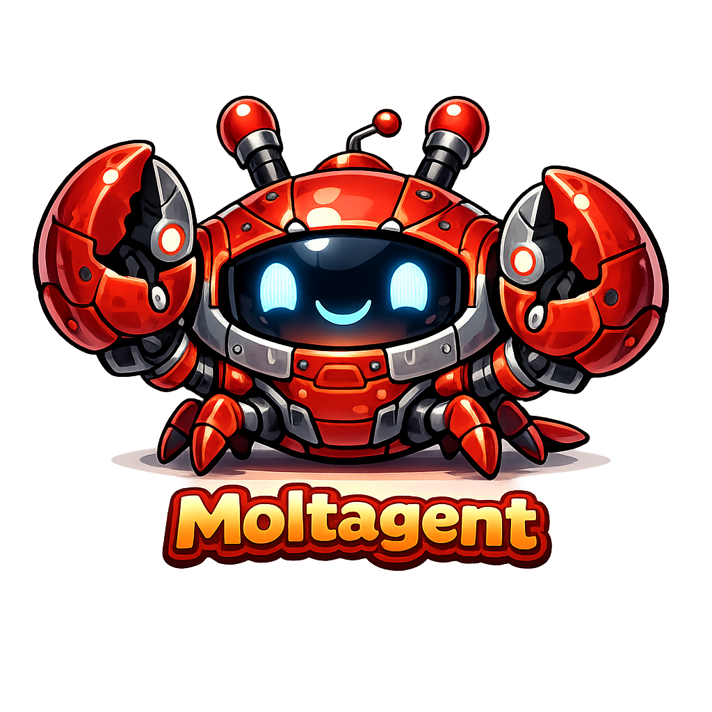
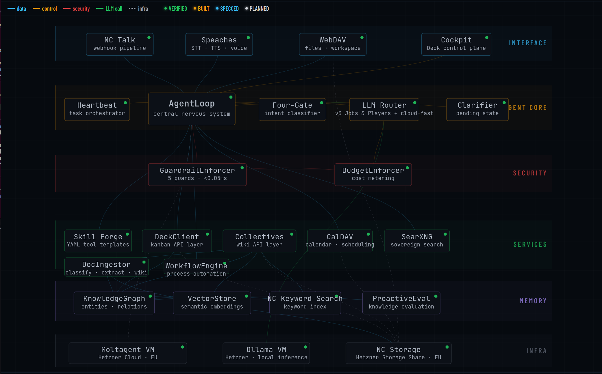

[English](../README.md) | [Deutsch](README.de.md) | **Português**

---

> ℹ️ **Nota de tradução:** A versão canônica é o [README em inglês](../README.md). Esta tradução é mantida manualmente e pode estar desatualizada em relação ao original — em caso de divergência, prevalece o inglês.

---

<p align="center">
  <picture>
    <source media="(prefers-color-scheme: dark)" srcset="../assets/logo-dark.png">
    <source media="(prefers-color-scheme: light)" srcset="../assets/logo-light.png">
    
  </picture>
</p>

# Moltagent

**Plataforma de agente IA soberana construída no Nextcloud.**

Seu agente IA. Sua infraestrutura. Suas regras.

[](https://github.com/moltagent/moltagent/actions/workflows/test.yml)
[](https://www.gnu.org/licenses/agpl-3.0)

<p align="center">
  <a href="https://public.moltagent.cloud">
    
  </a>
</p>
<p align="center"><em>Visualização da arquitetura em tempo real em <a href="https://public.moltagent.cloud">public.moltagent.cloud</a></em></p>

---

> ⚠️ **Status: Beta. Construído para nosso uso, compartilhado com você.**
> 
> Moltagent roda em produção para seu criador. Eu o uso diariamente para fluxos de conteúdo, gestão de conhecimento e operações editoriais. Mas a arquitetura ainda está evoluindo, e alguns recursos estão parcialmente implementados.
> 
> O branch `main` é o que rodamos em produção. O branch `next` é onde o desenvolvimento ativo acontece. Espere mudanças significativas em `next`.
> 
> Falta polimento. É um sistema funcional que estou compartilhando porque acredito que infraestrutura de IA soberana deve ser código aberto.
> 
> **Como é construído:** Todo o código é desenvolvido em colaboração com Claude (Anthropic). Uma pessoa (eu) define a arquitetura, escreve especificações, toma decisões de design, revisa cada commit e testa em produção. Claude implementa. Cada recurso começa como uma especificação escrita, não como um prompt. Chame de vibe-coding se quiser, para mim é desenvolvimento assistido por IA. Nunca conseguiria produzir código da qualidade que Claude produz, mas consigo criar melhor arquitetura e soluções criativas.

---

## Por que existe

Sou empreendedor em série e ajudo pessoas a dirigir negócios. Redações, produção de conteúdo, trabalho com clientes. Precisávamos de um assistente de IA que pudesse lidar com e-mail, calendário, pesquisa e fluxos de trabalho de conteúdo entre pequenas equipes.

Tudo o que tentamos tinha o mesmo problema: nossos dados saem da nossa infraestrutura, vivem em servidores de outra pessoa, sob a jurisdição de outra pessoa, com os termos de serviço de outra pessoa. Mesmo que você não se importe com GDPR, você está correndo o risco de perder seu trabalho, sua configuração e seu contexto de negócio se a estrutura política ou comercial mudar. E é isso que está acontecendo agora.

Credenciais são armazenadas não se sabe onde. Não há como auditar o que a IA acessou e fez. Nenhum botão de desligamento que funcione em menos de um minuto. Revogar pode se tornar um pesadelo.

Procuramos algo que rodasse em nossa própria infraestrutura, potencialmente em uma máquina no porão de uma fazenda fora da rede. Deveria se integrar com as ferramentas que já usamos e nos dar controle real. E de alguma forma, isso não existia.

Então eu construí.

Moltagent é um agente de IA que vive no Nextcloud. Tem sua própria conta, seus próprios arquivos, seu próprio calendário, seu próprio quadro de tarefas e e-mail. Você compartilha com ele o que quer compartilhar, exatamente como ao integrar um colega humano. E você pode revogar todo acesso com um clique, exatamente como ao desligar um funcionário.

Estou compartilhando como código aberto porque todo negócio deveria poder usar IA com segurança e infraestrutura de negócio soberana não deve ser proprietária.

Pegue, explore, construa sobre isso. Melhore.

Vamos!

---

## O que faz

Moltagent é um funcionário digital para sua equipe, não um assistente pessoal por usuário. Constrói conhecimento institucional em todas as interações.

**Funciona no Nextcloud**:
Arquivos, calendário, contatos, e-mail, tarefas, wiki, quadros kanban. Sem dependências externas de SaaS para seus dados.

**Motor de fluxo de trabalho**:
Escreva regras como frases simples em cartões kanban. O agente as lê e executa. Sem programação visual, sem gráficos de nós, sem código. Pontos de verificação humanos (rótulos GATE) onde quer que você precise de julgamento editorial.

**Memória viva**:
Wiki de conhecimento com rastreamento de confiança e gestão de frescor. O agente aprende com documentos, conversas e fluxos de trabalho. Conhecimento que não é acessado decai naturalmente. Conhecimento que é usado se fortalece.

**Limites de confiança**:
Toda operação classificada como confiável ou não confiável. Trabalho sensível é roteado automaticamente para LLM local. Credenciais buscadas no momento do uso, imediatamente descartadas. Nunca armazenadas em disco.

**Busca soberana**:
SearXNG + Stract + Mojeek. Sem Google, sem rastreamento, sem bolhas de filtro.

**Voz e e-mail**:
Fala-para-texto, integração completa IMAP/SMTP. Humano-no-loop para envio.

**Medição de custos**:
Aplicação de orçamento por modelo. Limites diários, fallback automático para local quando orçamento se esgota. Você sempre sabe o que está gastando.

**Multilíngue**:
Alemão, inglês, português desde o dia um. O LLM é a camada de linguagem, não o código.

**Revogação instantânea**:
Desative a conta Nextcloud do agente. Todo acesso cessa. Menos de 60 segundos para bloqueio completo. Ou revogue credenciais de API individuais quando necessário. Simples.

---

## Como funciona

```
┌───────────────────────────────────────────────────────────┐
│                    YOUR INFRASTRUCTURE                    │
│                                                           │
│  ┌───────────────┐  ┌───────────────┐  ┌───────────────┐  │
│  │  Nextcloud    │  │  Moltagent    │  │  Ollama       │  │
│  │  StorageShare │  │  Bot VM       │  │  (Local LLM)  │  │
│  │               │  │               │  │               │  │
│  │  • Identity   │  │               │  │               │  │
│  │  • Files      │  │  • Agent      │  │  • Air-       │  │
│  │  • Passwords  │  │    runtime    │  │    gapped     │  │
│  │  • Calendar   │  │  • No secrets │  │  • Handles    │  │
│  │  • Wiki       │  │    stored     │  │    sensitive  │  │
│  │  • Audit logs │  │               │  │    ops        │  │
│  └───────┬───────┘  └───────┬───────┘  └────────┬──────┘  │
│          │    HTTPS         │   Ollama API      │         │
│          │◄─────────────────┤◄──────────────────┤         │
│          │                  │                   │         │
│          │                  ├──► Cloud LLM APIs │         │
│          │                  │   (allowlisted)   │         │
└──────────┴──────────────────┴───────────────────┴─────────┘
```

Três componentes, isolados em rede. Comprometimento de um não compromete os outros. O VM Ollama não tem acesso à Internet e operações sensíveis a credenciais nunca saem de sua infraestrutura.

→ [Documentação de arquitetura completa](../docs/architecture.md)

---

## Provedores de LLM

Moltagent é agnóstico de provedor com 13 adaptadores suportados. Escolha seu compromisso:

| Predefinição    | Nome no Cockpit | O que acontece                                          | Custo      |
| --------------- | --------------- | ------------------------------------------------------- | ---------- |
| **all-local**   | Apenas Local    | Tudo roda em seu Ollama. Zero custo de nuvem.          | €0         |
| **smart-mix**   | Equilibrado     | Nuvem primária, fallback local. Otimizado por tipo de tarefa. | ~€3-20/mo  |
| **cloud-first** | Premium         | Apenas nuvem. Qualidade máxima.                         | ~€10-50/mo |

Suportado: Anthropic, OpenAI, Google, DeepSeek, Mistral, Groq, Perplexity, OpenRouter, xAI, Together, Fireworks, Ollama, ou adicione o seu.

Duas regras rígidas independentemente da predefinição: operações com credenciais sempre permanecem locais, e todas as predefinições voltam para local quando a nuvem não está disponível. Seu agente nunca fica offline.

→ [Configuração completa de provedores e roteamento de tarefas](../docs/providers.md)

---

## Estado atual

**Dashboard de desenvolvimento em tempo real em** [public.moltagent.cloud](https://public.moltagent.cloud) - centro de controle com status de verificação de recursos, gráfico de arquitetura, histórico de commits e visualização do ciclo de vida do conhecimento. Atualizado em tempo real do VM de produção.

Usamos Moltagent diariamente para nossas operações. Aqui está uma visão geral do status:

**Funcionando e em uso diário:**

- Integração Nextcloud (arquivos, calendário, contatos, e-mail, wiki, deck kanban)
- Motor de fluxo de trabalho com máquina de estados de rótulo GATE/PAUSED/SCHEDULED/ERROR
- Pipeline de conteúdo (avaliação de ideias → rascunho → revisão → revisão editorial → publicação)
- Wiki de conhecimento com ingestão de documentos e extração de entidades
- Busca soberana (SearXNG + Stract + Mojeek)
- Pipeline de voz (Speaches STT)
- Medição de custos e aplicação de orçamento
- Roteamento de LLM com 13 adaptadores de provedor
- 217 testes, todos passando

**Funcionando, mas ainda sendo refinado:**

- Agendamento de fluxo de trabalho e ativação de cartão cronometrado
- Spawning de múltiplos quadros e fluxos de trabalho entre quadros
- Loops de feedback editorial (ciclos de revisão)
- Reuniões inteligentes no calendário e rastreamento de RSVP

**Ainda não construído:**

- Instalador com um clique
- Assistente de configuração baseado em web
- Adaptadores de plataforma de chat (Slack, Telegram, WhatsApp)
- Integração CMS Drupal / WordPress
- Federação entre instâncias Moltagent

**Limitações conhecidas:**

- Ritmo acelerado de desenvolvimento: a arquitetura pode mudar entre lançamentos
- Projetado para Linux + Nextcloud. Sem Windows, sem macOS, sem Docker (ainda não)
- Requer familiaridade com systemd, SSH e administração básica de servidor
- O agente é tão bom quanto o LLM que o impulsiona. Modelos locais lidam com fluxos de trabalho simples, mas trabalho editorial complexo precisa de modelos de nuvem (o que pode mudar em breve, dado o desenvolvimento rápido de IA local)

---

## Primeiros passos

Moltagent roda como um serviço systemd no Linux com backend Nextcloud. A configuração recomendada usa três VMs Hetzner com isolamento de rede. Custo de infraestrutura mensal: ~30 euros/mês para iniciantes, menos de 250 euros/mês para negócio sério.

Isso não é uma instalação com um clique. Você precisa estar confortável com administração de servidor ou ter alguém que esteja.

→ [Guia de configuração](../docs/quickstart.md) - configuração Nextcloud, implantação de VM, regras de firewall, armazém de credenciais

→ [Primeiros passos](../docs/getting-started.md) - uma vez que está rodando, o que você realmente faz na sua primeira hora

---

## Como é construído

Moltagent é desenvolvido por um fundador solo usando Claude como parceiro de arquitetura e implementação. A metodologia:

1. **Especificações, não prompts** 
   Cada recurso começa como um documento arquitetônico escrito que descreve o problema, o design, os casos extremos e os critérios de saída. Essas especificações têm em média 15-25KB cada. Existem mais de 70 delas.

2. **Pensamento sistêmico antes de código** 
   Quando um bug aparece, não corrigimos a instância. Perguntamos: que classe de problema é este? O que o gera? O gerador pode ser corrigido? Duas instâncias do mesmo padrão significa parar de corrigir e encontrar a causa estrutural.

3. **O TAO da boa engenharia**
   Sem regex para inteligência. Se o código está compensando por IA fraca, fortaleça a IA, não adicione mais código. Menos código, não mais. A solução correta na altitude correta substitui cinco soluções na altitude errada. Multilíngue por padrão. Se funciona apenas em inglês, é um protótipo, não um recurso.

4. **CONSTRUÍDO ≠ VERIFICADO**
   Um recurso é completo apenas depois de comportamento confirmado em produção, não depois que os testes passam. Rodamos cada mudança em produção em nossa própria infraestrutura antes de chamar de pronto.

O histórico de commits reflete sessões reais de depuração, decisões arquitetônicas e observações de produção. Isso é intencional. Quero que o processo de desenvolvimento seja legível, não apenas o código final.

---

## Filosofia

### O modelo de emprego

Quando aprendi sobre IA agentiva em janeiro de 2026, fiquei imediatamente entusiasmado. Poderia automatizar fluxos de trabalho, lidar com administração financeira, agir como um repositório de conhecimento interativo para meus clientes?

Quando aprofundei, fiquei com medo. Muito medo. Credenciais em arquivos de texto. Nenhum caminho de revogação. Nenhum rastreamento de auditoria. E quanto a injeções de prompt?

Conectei os pontos: e se o agente de IA vivesse no meu Nextcloud e tivesse tudo que meus funcionários têm? Uma identidade real, um espaço de trabalho real, revogação real.

Isso é o que Moltagent é.

### IA soberana

IA soberana não deveria ser um modismo. Significa que seu negócio não depende da operação contínua de outra pessoa. Roda em sua infraestrutura com seus dados. E se qualquer provedor desaparecer amanhã, você ainda consegue continuar trabalhando.

Moltagent roda em uma máquina em seu escritório, oficina ou fazenda. Ou em um servidor virtual na Hetzner. Sua escolha.

---

## Documentação

|                                            |                                                          |
| ------------------------------------------ | -------------------------------------------------------- |
| [Iniciar](../docs/quickstart.md)           | Comece em 30 minutos                                     |
| [Primeiros passos](../docs/getting-started.md) | Sua primeira hora: primeira conversa, compartilhamento de dados, tarefas reais |
| [Guia de implantação](../docs/deployment.md)   | SearXNG, Speaches, e-mail, credenciais, configuração completa |
| [Arquitetura](../docs/architecture.md)    | Isolamento de VM tríplice, segmentação de rede           |
| [Modelo de segurança](../docs/security-model.md) | Limites de confiança, mediação de credenciais, modelo de ameaça |
| [Credenciais](../docs/credentials.md)     | Mapeamento de campo Senhas NC para cada credencial       |
| [Configuração](../docs/configuration.md)  | Referência completa para config.yaml                     |
| [Provedores de LLM](../docs/providers.md) | 13 adaptadores, roteamento de tarefas, otimização de custos |

---

## Contribuindo

Este projeto é desenvolvido colaborativamente com IA. Se isso incomoda você, tudo bem. O código é licenciado sob AGPL-3.0 e fala por si.

Veja [CONTRIBUTING.md](../.github/CONTRIBUTING.md) para diretrizes.

**Problemas de segurança:** Por favor reporte via [security@moltagent.cloud](mailto:security@moltagent.cloud). Não abra issues públicas para vulnerabilidades.

---

## Licença

[AGPL-3.0](../LICENSE)

Se você melhorar Moltagent, essas melhorias beneficiam a todos. 

---

## Agradecimentos

- [Nextcloud](https://nextcloud.com) - o ecossistema que torna a IA soberana possível
- [Ollama](https://ollama.com) - inferência de LLM local
- [Claude](https://anthropic.com) - parceiro de arquitetura e colaborador de implementação
- A comunidade auto-hospedada, por valorizar soberania sobre conveniência

---

```
Sua IA. Sua infraestrutura. Suas regras.
```
